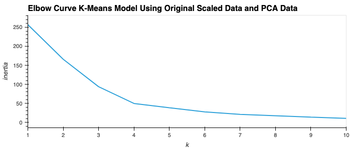

# Crypto Clustering

* Python notebook file for code: crypto_investments.ipynb
* Resources contains csv file data for analysis

## Preparing the Data and K-Means Model 

Q: What is the best value for k?

A: 4 is the best value for k

## Cluster Cryptocurrencies with K-means Using the Original Data

## Optimize Clusters with Principal Component Analysis: 

### Find the Best Value for k Using the PCA Data

Q: What is the best value for k when using the PCA data?

A: 4 is the best value for k

Q: Does it differ from the best k value found using the original data?

A: No it does not differ

## Cluster Cryptocurrencies with K-means Using the PCA Data

## Visualize and Compare the Results

Q: After visually analyzing the cluster analysis results, what is the impact of using fewer features to cluster the data using K-Means?

A: The variance or inertia total is lower with fewer features to cluster and this can be seen in the tighter clustering scatterplot and also the K-Means Model built on PCA Data shows lower total inertia or variance at all k values in the model.
